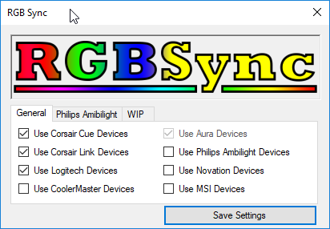

# RGBSync

A ready to use application for syncing RGB.NET capable devices. it uses Aura as the master and mimics that to all other RGB.NET capable devices and Corsair Link Lighting Node Pro / Commander Pro.

PLEASE NOTE RGBSYNC DOES NOT WORK ON RYZEN BOARDS (ALL THE ONES TESTED ATLEAST) DUE TO THIS BUG - https://rog.asus.com/forum/showthread.php?97533-Calling-GetMBColor-returns-only-white

ANY RYZEN MOTHERBOARD BUG REPORTS STATING IT'S ONLY WHITE/BLACK WILL BE CLOSED.

RGB.NET = https://github.com/DarthAffe/RGB.NET/

HidSharp = https://github.com/jcoenraadts/hid-sharp

Thanks to Zenairo for the bases of the code to control Corsair Link Lighting Node Pro / Commander Pro

Supported Devices

- Corsair Cue
- Corsair Link
- Asus Aura (SyncBack Source)
- MSI
- Cooler Master
- Logitech
- Novation

Any RGB.NET supported devices can be added relatively easily, just raise a issue.
